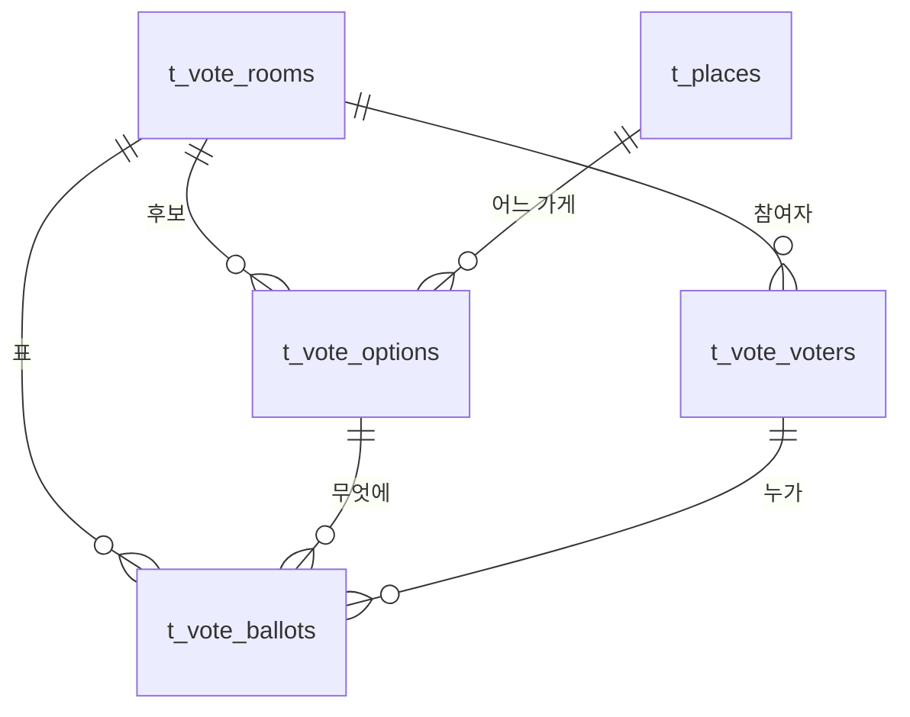

# DINNERSPOT

회식 장소를 조건에 맞춰 점수순으로 추천하고, 후보를 팀에 링크로 보내 투표로 정하는 서비스.

- **백엔드** CodeIgniter 3.1.13 + MariaDB / MySQL
- **프론트엔드** CI3 서버 렌더링 뷰 + 바닐라 JS (빌드 도구 없음)
- **장소 데이터** 네이버 지역검색 API + DB 캐시 (키가 없으면 샘플 데이터로 동작)

---

## 1. 설치

새 PC 에서 처음부터 하는 순서입니다. **내려받아야 하는 것은 두 개뿐**입니다.

| 무엇 | 왜 | 어디서 |
|---|---|---|
| **XAMPP** (PHP 8.2 버전) | Apache · PHP · MariaDB 를 한 번에 깔고 서로 연결까지 해 줍니다 | <https://www.apachefriends.org/download.html> |
| **Git** | 저장소를 받으려고 | <https://git-scm.com/download/win> |
| ~~MariaDB~~ | **따로 설치하지 않습니다** — XAMPP 안에 10.4 가 들어 있습니다 | — |
| ~~CodeIgniter 3.1.13~~ | **따로 설치하지 않습니다** — `system/` 폴더로 저장소에 들어 있습니다 (206개 파일) | — |
| ~~Composer · npm~~ | **쓰지 않습니다** — 외부 패키지 의존성이 없습니다 | — |

CodeIgniter 를 저장소에 함께 넣어 둔 이유가 이것입니다. `git clone` 한 번으로 프레임워크까지
같이 오므로 버전이 어긋날 일이 없고, 설치 단계에서 할 일이 줄어듭니다.

---

### 1단계 · XAMPP 설치

**1)** 위 주소에서 **PHP 8.2** 가 붙은 Windows 설치 파일을 받습니다. 코드가 실제로 요구하는
최소는 **PHP 7.0** 이고(널 병합 연산자 `??` 를 씁니다), CodeIgniter 3.1.13 이 권하는 것은
7.2 이상입니다. 8.2 로 개발했습니다.

**2)** 설치 경로는 **기본값 `C:\xampp` 를 그대로 두세요.** 경로에 한글이나 공백이 들어가면
CLI 에서 따옴표를 계속 신경 써야 하고, 이 문서의 명령을 그대로 복사할 수 없게 됩니다.

**3)** 설치 항목은 기본 선택 그대로 두면 됩니다. 이 프로젝트에 필요한 것은 `Apache` ·
`MySQL`(= MariaDB) · `phpMyAdmin` 셋이고 전부 기본으로 포함됩니다. `Tomcat` 이나 `Perl` 은
필요 없으니 체크를 풀어도 됩니다.

**4)** 설치가 끝나면 **XAMPP Control Panel** 에서 `Apache` 와 `MySQL` 의 **Start** 를
누릅니다. 두 줄이 초록색이 되어야 합니다.

**5)** 브라우저에서 <http://localhost/> 가 열리면 Apache 가 정상입니다.

#### 설치 후 경로

이 문서에서 쓰는 경로입니다. XAMPP 를 `C:\xampp` 에 깔았다면 그대로 맞습니다.

| 무엇 | 경로 |
|---|---|
| 프로젝트를 두는 곳 | `C:\xampp\htdocs\` |
| PHP 실행파일 | `C:\xampp\php\php.exe` |
| PHP 설정 | `C:\xampp\php\php.ini` |
| MariaDB 클라이언트 | `C:\xampp\mysql\bin\mysql.exe` |
| MariaDB 설정 | `C:\xampp\mysql\bin\my.ini` |
| MariaDB 데이터 | `C:\xampp\mysql\data\` |
| Apache 설정 | `C:\xampp\apache\conf\httpd.conf` |
| phpMyAdmin | <http://localhost/phpmyadmin> |

#### PHP 와 mysql 은 PATH 에 등록되지 않습니다

XAMPP 설치 프로그램은 환경 변수를 건드리지 않습니다. 그래서 새 PC 에서는 `php` 나 `mysql` 을
그냥 치면 "명령을 찾을 수 없습니다" 가 납니다. 확인해 보세요.

```bash
C:/xampp/php/php.exe -v
```

이 문서는 안전하게 **전체 경로**로 적었습니다. 짧게 쓰고 싶으면 시스템 환경 변수 `Path` 에
`C:\xampp\php` 와 `C:\xampp\mysql\bin` 을 추가하고 터미널을 새로 여세요. 그 뒤에는
`php tools/setup.php` 처럼 쓸 수 있습니다.

#### 필요한 PHP 확장

`mysqli` · `curl` · `mbstring` · `json` · `openssl` 다섯 개이고 **XAMPP 기본 설치에 모두
들어 있습니다.** 직접 확인할 필요는 없습니다 — 4단계의 점검 스크립트가 봐 줍니다. 혹시
빠져 있으면 `C:\xampp\php\php.ini` 에서 `extension=<이름>` 앞의 `;` 를 지우고 Apache 를
재시작합니다.

#### Apache 가 켜지지 않을 때

80 포트를 다른 프로그램이 쓰고 있는 것입니다. Windows 에서는 IIS, 일부 백신, 가끔 Skype 가
범인입니다. Control Panel 의 `Netstat` 버튼으로 누가 쓰는지 볼 수 있습니다. 그 프로그램을
끄거나, `httpd.conf` 에서 `Listen 80` 을 `Listen 8080` 으로 바꾸고 재시작합니다.

**포트를 바꿔도 이 프로젝트는 고칠 것이 없습니다.** 주소가 `http://localhost:8080/DINNERSPOT/`
로 바뀌지만 `base_url` 이 요청의 `Host` 헤더에서 포트까지 그대로 가져옵니다. 다만 **네이버
지도 콘솔의 Web 서비스 URL 에는 포트까지 정확히 등록**해야 지도가 인증됩니다
(→ **4. 네이버 API 연결**).

---

### 2단계 · MariaDB 설정

XAMPP 안에 **MariaDB 10.4** 가 들어 있습니다. 따로 설치하지 마세요 — 별도로 깔면 3306 포트가
겹쳐 둘 중 하나가 안 켜집니다.

> MariaDB 는 MySQL 과 호환됩니다. XAMPP 는 실행파일 이름과 Control Panel 표기를 `MySQL` 로
> 쓰지만 실체는 MariaDB 입니다. 이 문서에서 `mysql.exe` 라고 적은 것도 MariaDB 클라이언트입니다.

#### 확인

Control Panel 에서 `MySQL` 을 Start 한 뒤:

```bash
C:/xampp/mysql/bin/mysql.exe -uroot -e "SELECT VERSION();"
```

`10.4.x-MariaDB` 가 나오면 됩니다. 포트는 기본 **3306** 이고 `my.ini` 의 `[mysqld] port` 에
있습니다.

#### root 비밀번호 — 기본은 "없음" 입니다

XAMPP 의 MariaDB 는 `root` 계정에 비밀번호가 없는 상태로 시작합니다. 이 프로젝트의
`application/config/database.php` 도 그 전제로 되어 있습니다.

```php
'hostname' => 'localhost',
'username' => 'root',
'password' => '',
'database' => 'dinnerspot',
```

로컬 개발용이라 그대로 씁니다. 비밀번호를 걸었다면 `'password'` 를 채우고, 점검 스크립트에는
`--db-pass=비번` 으로 알려 주세요.

> 외부에서 접속되는 PC 라면 비밀번호를 반드시 거세요. XAMPP 는 개발용 기본값이라 그대로
> 두면 같은 네트워크에서 DB 에 접근할 수 있습니다.

#### 문자셋 — 한글이 깨지면 여기입니다

이 프로젝트는 가게 이름·주소·역 이름이 전부 한글이라 문자셋이 중요합니다. **서버 쪽은
`utf8mb4` 여야 합니다.** 확인:

```bash
C:/xampp/mysql/bin/mysql.exe -uroot -e "SHOW VARIABLES LIKE 'character_set_server';"
```

`utf8mb4` 가 아니면 `C:\xampp\mysql\bin\my.ini` 의 `[mysqld]` 블록에 아래를 넣고 MySQL 을
재시작합니다.

```ini
[mysqld]
character-set-server=utf8mb4
collation-server=utf8mb4_general_ci
```

**`my.ini` 는 XAMPP 폴더에 있어 git 에 올라가지 않습니다.** 이 저장소를 받아도 따라오지
않으므로 새 PC 에서는 위 값을 직접 확인해야 합니다.

한편 **명령줄 클라이언트는 Windows 콘솔 코드페이지(CP949) 때문에 `euckr` 로 붙습니다.**
서버가 utf8mb4 여도 그렇습니다. 그래서 한글을 조회할 때는 **`--default-character-set=utf8mb4`
를 붙이세요.**

```bash
C:/xampp/mysql/bin/mysql.exe -uroot --default-character-set=utf8mb4 dinnerspot -e "SELECT name FROM t_areas LIMIT 3;"
```

`sql/01_schema.sql` 과 `02_seed.sql` 은 파일 안에서 스스로 `SET NAMES utf8mb4` 를 실행하므로
이 옵션이 없어도 **데이터는 바르게 들어갑니다.** 옵션이 필요한 쪽은 **결과를 눈으로 볼
때**입니다. 붙이지 않으면 화면에만 깨져 보입니다.

눈으로 확인하려면 <http://localhost/phpmyadmin> 이 더 편합니다. 브라우저는 UTF-8 로
표시하므로 콘솔 코드페이지 문제가 없습니다.

#### 이미 MySQL 이 깔려 있는 PC 라면

3306 을 이미 쓰고 있어 XAMPP 의 MySQL 이 안 켜집니다. 셋 중 하나를 고르세요.

- 기존 MySQL 서비스를 끄고 XAMPP 것을 쓴다 (가장 간단)
- 기존 MySQL 을 그대로 쓴다 — `01_schema.sql` · `02_seed.sql` 을 그 서버에 넣고
  `database.php` 의 접속 정보를 맞춥니다. MySQL 5.7 이상이면 됩니다
- XAMPP 의 MariaDB 포트를 `my.ini` 에서 3307 로 바꾸고 `database.php` 의 `hostname` 을
  `localhost:3307` 로 적는다

---

### 3단계 · 저장소 받기

```bash
cd C:/xampp/htdocs
git clone https://github.com/someguy163/DINNERSPOT.git
```

**`htdocs` 아래여야** Apache 가 서빙합니다. 폴더 이름은 무엇이든 됩니다 (뒤의 *폴더 이름은
무엇이든 됩니다* 참고).

저장소가 비공개라면 `clone` 할 때 GitHub 로그인이 필요합니다. 요즘 GitHub 는 비밀번호를
받지 않으므로 **Personal Access Token** 을 만들어 비밀번호 자리에 붙여넣거나, GitHub CLI
(`gh auth login`) 로 한 번 인증해 두세요.

---

### 4단계 · 한 줄로 설치

```bash
C:/xampp/php/php.exe tools/setup.php --install
```

DB 생성 · 테이블 · 시드 · 로컬 설정 파일 복사까지 빠진 것만 만들고, 남은 할 일을 번호로
알려줍니다. 프로젝트 폴더에서 실행하세요.

**옵션 없이 실행하면 아무것도 바꾸지 않고 점검만** 합니다. 무엇이 빠졌는지 먼저 보려면
이렇게 하세요.

```bash
C:/xampp/php/php.exe tools/setup.php
```

점검 항목은 PHP 버전과 확장 5개, `application/cache`·`logs` 쓰기 권한, 로컬 설정 파일과
키 4개(값은 출력하지 않고 채워졌는지만), MySQL 접속과 테이블 9개와 행 수, 그리고 홈 화면
HTTP 응답 · `base_url` · `mod_rewrite` 입니다. 고칠 것이 있으면 종료코드 1 로 끝나므로
스크립트에서도 쓸 수 있습니다.

> `--install` 은 **기존 테이블을 지우지 않습니다.** 테이블이 이미 있으면 `01_schema.sql` 을
> 건너뜁니다(`02_seed.sql` 은 멱등이라 다시 넣습니다). 정말 초기화하려면 `--force` 가
> 필요하고, 그때는 5초 카운트다운 후 진행합니다.

---

### 5단계 · API 키 넣기 — git 에 없는 유일한 것

**실제 키가 담긴 `application/config/dinnerspot_local.php` 는 `.gitignore` 로 제외되어 있어
저장소에 올라가지 않습니다.** 키가 공개되면 남이 내 호출량을 쓰고 과금까지 될 수 있기
때문입니다. 그래서 새 PC 에서는 이 파일이 **없습니다.**

대신 값이 전부 비어 있는 **`dinnerspot_local.php.example` 이 git 에 올라갑니다.** 이것을
복사해서 이름에서 `.example` 을 떼면 됩니다. 4단계의 `--install` 이 이미 복사해 두었으니,
열어서 값만 채우면 됩니다.

```bash
cp application/config/dinnerspot_local.php.example application/config/dinnerspot_local.php
```

`cp` 는 Git Bash 용입니다. **명령 프롬프트(cmd)** 에서는 `copy`, **PowerShell** 에서는
`Copy-Item` 을 쓰세요 — 셋 다 하는 일은 같습니다.

채울 값은 네 개입니다.

| 항목 | 없으면 어떻게 되나 | 발급처 |
|---|---|---|
| `naver_client_id` · `naver_client_secret` | 실제 상권 대신 **샘플 43곳**으로만 추천 | NAVER API HUB 또는 개발자센터 |
| `naver_map_key_id` | 상세 화면 지도와 "지도에서 기준점 조정" 이 빠짐 | 네이버 클라우드 플랫폼 Maps |
| `admin_password` | `/admin` 이 404 (의도된 동작) | 직접 정하는 문자열 |

발급 경로와 콘솔에서 눌러야 하는 버튼까지 **그 파일 주석에 항목별로** 적혀 있습니다.
→ **4. 네이버 API 연결**

**키가 없어도 앱은 전부 돌아갑니다.** 추천 · 필터 · 투표 · 관리자(비번을 넣었다면)가 모두
동작하고, 장소만 시드에 든 샘플 43곳으로 나옵니다. 먼저 실행해 보고 나중에 키를 넣어도
됩니다. 서버 재시작도 필요 없습니다 — 새로고침하면 반영됩니다.

#### 집과 회사에서 같은 키를 쓸 수 있나

**지역검색 키는 그대로 됩니다.** 서버에서 호출하므로 접속 위치와 무관합니다.

**지도 Key ID 는 콘솔에 등록한 Web 서비스 URL 에 달려 있습니다.** 양쪽 다
`http://localhost/...` 로 접속한다면 `http://localhost` 하나만 등록해 두면 두 PC 에서 모두
됩니다. 포트를 바꿨거나 IP 로 접속한다면 그 주소도 콘솔에 추가하세요.

#### 키를 새 PC 로 옮기는 방법

- 콘솔에 다시 로그인해서 값을 확인하고 붙여넣기 (가장 확실합니다)
- 또는 `dinnerspot_local.php` 파일 자체를 USB · 비공개 저장소 · 암호 관리자로 옮기기

**절대 git 에 올리지 마세요.** `.gitignore` 가 막고 있지만 `git add -f` 로는 강제로
올라갑니다. 그리고 **`dinnerspot.php` 에 키를 넣지 마세요** — 그 파일은 git 에 올라가고,
어차피 맨 아래에서 local 파일을 include 하므로 local 쪽 값이 항상 이깁니다.

---

### 6단계 · 확인

브라우저에서 <http://localhost/DINNERSPOT/> 를 엽니다. 점검 스크립트를 한 번 더 돌려 전부
초록인지 봅니다.

```bash
C:/xampp/php/php.exe tools/setup.php
```

키를 넣었다면 <http://localhost/DINNERSPOT/guide> 에서 네이버 연결 진단 결과를 볼 수
있습니다. 어느 발급처의 키인지, 인증이 통과했는지, 실패면 무엇을 확인해야 하는지까지
화면에 나옵니다.

---

### 손으로 하기 (점검 스크립트 없이)

**1)** 저장소를 `htdocs` 아래에 둡니다 — `C:\xampp\htdocs\DINNERSPOT`

**2)** DB 를 만듭니다.

```bash
C:/xampp/mysql/bin/mysql.exe -uroot --default-character-set=utf8mb4 < sql/01_schema.sql
```

```bash
C:/xampp/mysql/bin/mysql.exe -uroot --default-character-set=utf8mb4 dinnerspot < sql/02_seed.sql
```

`01_schema.sql` 은 스스로 `CREATE DATABASE dinnerspot` 과 `USE` 를 하므로 DB 를 미리 만들지
않아도 됩니다. 그래서 첫 명령에는 DB 이름을 적지 않습니다.

**3)** API 키 파일을 만듭니다 (5단계 참고).

```bash
cp application/config/dinnerspot_local.php.example application/config/dinnerspot_local.php
```

`cp` 는 Git Bash 용입니다. **명령 프롬프트(cmd)** 에서는 `copy`, **PowerShell** 에서는
`Copy-Item` 을 쓰세요 — 셋 다 하는 일은 같습니다.

**4)** <http://localhost/DINNERSPOT/> 로 접속합니다.

---

### 자주 걸리는 것

| 증상 | 원인 | 조치 |
|---|---|---|
| `php` 명령을 찾을 수 없음 | XAMPP 가 PATH 를 건드리지 않습니다 | `C:\xampp\php\php.exe` 전체 경로로 실행 |
| Apache 가 Start 안 됨 | 80 포트 충돌 | Control Panel `Netstat` 로 확인, 또는 `httpd.conf` 의 `Listen` 변경 |
| MySQL 이 Start 안 됨 | 3306 충돌 (기존 MySQL) | 2단계의 *이미 MySQL 이 깔려 있는 PC 라면* 참고 |
| 홈은 열리는데 링크가 404 | `mod_rewrite` 가 꺼져 있음 | `httpd.conf` 에서 `LoadModule rewrite_module` 주석 해제 + `AllowOverride All` |
| 화면은 뜨는데 CSS 가 안 먹음 | `.htaccess` 가 무시되는 중 | `AllowOverride All` 확인 |
| 콘솔에서 한글이 깨져 보임 | 클라이언트가 `euckr` 로 붙음 | `--default-character-set=utf8mb4` 추가, 또는 phpMyAdmin 사용 |
| DB 에 한글이 깨져 저장됨 | 서버 charset 이 utf8mb4 가 아님 | 2단계의 *문자셋* 참고 후 재시작 |
| 추천 결과가 항상 같은 43곳 | 지역검색 키가 없음 | 5단계 참고. `/guide` 에서 진단 |
| 지도만 안 뜸 | 지도 Key ID 없음, 또는 Web 서비스 URL 미등록 | **4. 네이버 API 연결** |
| `/admin` 이 404 | `admin_password` 가 비어 있음 | 값을 넣으면 열립니다 (의도된 동작) |

---

### 폴더 이름은 무엇이든 됩니다

`htdocs/dinnerspot`, `htdocs/ds` 어디에 두어도 그대로 동작합니다 — `base_url` 은
`SCRIPT_NAME` 에서 설치 폴더를 뽑고(`config.php` 의 `$ds_dir` 블록), `.htaccess` 는
`RewriteBase` 를 일부러 적지 않아 아파치가 그 파일이 놓인 디렉터리를 기준으로 잡습니다.
예전에는 두 곳에 `/DINNERSPOT/` 이 박혀 있어 폴더를 바꾸면 404 가 나거나 CSS 가 깨졌지만,
지금은 고칠 것이 없습니다.

**포트·도메인·IP 도 고칠 것이 없습니다.** `base_url` 은 요청의 `Host` 헤더에서 스킴과
호스트를 그대로 가져와 조립하므로(`config.php` 의 `$ds_host` 블록), 같은 공유기의 다른
PC 가 `http://192.168.0.5/DINNERSPOT/` 로 들어와도 링크와 CSS 경로가 그 주소를 따라갑니다.
여기에 `http://localhost/DINNERSPOT/` 같은 고정 문자열을 다시 박으면 그 화면이 통째로
깨집니다 — **고정하지 마세요.**

**단, DB 이름 `dinnerspot` 은 SQL 파일에 박혀 있습니다.** `sql/01_schema.sql` 과
`02_seed.sql` 안에 ``USE `dinnerspot` `` 이 있어서, `database.php` 의 `'database'` 만 바꾸면
점검은 A 를 보면서 실행은 B 를 건드리게 됩니다. `tools/setup.php` 는 두 이름이 다르면
**실행을 거부하고** 어느 쪽을 맞출지 알려줍니다. DB 이름을 바꾸려면 두 SQL 파일의
`CREATE DATABASE` · `USE` 도 함께 고치세요.

> **이미 쓰던 DB 에 `01_schema.sql` 을 다시 돌리면 안 됩니다** — DROP TABLE 로 시작해서
> 투표 기록과 수집한 장소가 전부 사라집니다. 스키마를 바꿀 때는 `sql/00_migrate.sql` 을
> 쓰세요. → **3. 데이터베이스**

## 2. 개발 환경 · 인프라

### 실행 스택

| 층 | 사용 기술 | 확인된 버전 | 비고 |
|---|---|---|---|
| OS | Windows 10 Pro | 10.0.19045 | macOS · Linux 도 동작 (경로 표기만 다름) |
| 웹서버 | Apache (XAMPP) | — | `mod_rewrite` + `AllowOverride All` 필요 |
| 런타임 | PHP | 8.2.12 | CI 3.1.x 가 안정적으로 도는 상한대 |
| 프레임워크 | CodeIgniter | 3.1.13 | `system/` 에 동봉 — 별도 설치 없음 |
| DB | MariaDB | 10.4.32 | MySQL 5.7 이상도 동작 |
| 프론트 | 서버 렌더링 뷰 + 바닐라 JS | — | 빌드·번들·트랜스파일 **없음** |

로컬 경로와 접속 주소는 이렇게 맞춰져 있습니다.

```
C:/xampp/htdocs\DINNERSPOT   →   http://localhost/DINNERSPOT/
```

### 의존성 설치 단계가 없습니다

`composer install` 도 `npm install` 도 하지 않습니다.

- 루트의 `composer.json` 은 CodeIgniter 배포본이 원래 갖고 있는 파일이고, 이 프로젝트는 쓰지 않습니다
  (`config['composer_autoload'] = FALSE`, `vendor/` 디렉터리 없음)
- 프론트엔드에 패키지 매니저를 쓰지 않습니다. `assets/css/app.css` 한 장과 `assets/js/*.js` 7개가 전부입니다
- CSS 프레임워크·아이콘 세트·분석 스크립트를 쓰지 않습니다. **딱 하나 외부에서 받는 것은 본문 서체**로,
  `app.css` 첫 줄이 Pretendard dynamic-subset 을 CDN 에서 `@import` 합니다
  (`cdn.jsdelivr.net/gh/orioncactus/pretendard@v1.3.9`). 이 줄이 막혀도 시스템 서체로 폴백하므로
  기능에는 영향이 없습니다 — 서체만 달라집니다

저장소를 받아서 `htdocs` 아래에 두고 DB만 만들면 실행됩니다.

### 필수 PHP 확장

| 확장 | 용도 | 없으면 |
|---|---|---|
| `mysqli` | DB 드라이버 (`database.php`) | 앱 실행 불가 |
| `curl` | 네이버 API 호출 (`Naver_local::http_get`) | 수집 불가 — 샘플 장소로만 동작 |
| `openssl` | HTTPS 인증서 검증 (`CURLOPT_SSL_VERIFYPEER = TRUE`) | 네이버 호출 실패 |
| `mbstring` | 한글 문자열 처리 (카테고리 매핑, 지역명 검색) | 분류·검색 오작동 |
| `json` | API 응답 파싱, JSON 응답 | 앱 실행 불가 |

XAMPP 기본 설치에 전부 포함되어 있습니다. 확인은 `php tools/setup.php` 가 대신 해 줍니다
(직접 보려면 `php -m`). 새로 깐 XAMPP 는 `php` 가 PATH 에 없으니
`C:/xampp/php/php.exe` 를 쓰세요 — **1. 설치** 참고.
`/guide` 는 **네이버 연결 진단 화면이고 확장 목록은 보여주지 않습니다.**

### 외부와 통신하는 곳은 세 군데뿐

| 대상 | 어디서 호출 | 없을 때 |
|---|---|---|
| 네이버 지역검색 API | **서버** (PHP cURL) | 키가 없으면 호출 자체를 하지 않음 → 샘플 43곳으로 추천 |
| 네이버 지도 JS v3 | **브라우저** (`oapi.map.naver.com` 스크립트) | 장소 상세는 지도 대신 네이버 지도 링크, 홈·결과의 지도 기준점 조정은 출력되지 않음 |
| Pretendard 서체 | **브라우저** (`cdn.jsdelivr.net` · `app.css` 의 `@import`) | 시스템 서체로 폴백 (기능 영향 없음) |

세 번째는 서체라서, 앞의 둘을 빼면 인터넷 없이도 전체 기능이 동작합니다.

### 환경 구분과 오류 표시

`index.php` 가 `ENVIRONMENT` 를 정하고 오류 표시 수준을 나눕니다. 기본은 `development` 이며,
Apache 에서 `SetEnv CI_ENV production` 으로 바꿀 수 있습니다.

```php
// index.php
define('ENVIRONMENT', isset($_SERVER['CI_ENV']) ? $_SERVER['CI_ENV'] : 'development');
```

`development` 분기에서 `E_DEPRECATED` / `E_STRICT` 를 **의도적으로 제외**했습니다.
CodeIgniter 3.1.x 는 PHP 8.2 에서 동적 프로퍼티 deprecation 알림을 대량으로 발생시키고,
그 알림 텍스트가 JSON 응답 본문에 섞여 들어가 API 가 깨지기 때문입니다.

### 로그 · 세션 · 캐시가 쌓이는 위치

| 경로 | 내용 | git |
|---|---|---|
| `application/logs/log-YYYY-MM-DD.php` | CI 로그 (`log_threshold = 1`, 오류만) | 제외 |
| `application/cache/sessions/` | 세션 파일 (`sess_driver = 'files'`, 24시간) | 제외 |
| `t_search_logs` 테이블 | 검색 요청 기록 (추천 품질 확인용) | — |

세션은 DB 가 아니라 **파일**에 저장됩니다. 이 디렉터리에 웹서버 쓰기 권한이 있어야
관리자 로그인이 유지됩니다. 리눅스로 옮기면 권한을 확인하세요.

### 타임존

`application/config/constants.php` 에서 프로세스 타임존을 한국시간으로 고정합니다.

```php
defined('DS_TIMEZONE') OR define('DS_TIMEZONE', 'Asia/Seoul');
date_default_timezone_set(DS_TIMEZONE);
```

이 줄이 없으면 PHP 가 서버 기본 타임존을 쓰고, DB 의 `CURRENT_TIMESTAMP` 와 시각이
어긋납니다. 실제로 서버 타임존이 유럽으로 잡혀 있어 "몇 분 전" 표기와 투표 마감
자동 처리가 7시간씩 틀어진 적이 있습니다. **이 줄을 지우면 안 됩니다.**

### 부트스트랩 순서

```
index.php  (ENVIRONMENT, 오류 수준)
  └─ system/core/CodeIgniter.php
       ├─ config/constants.php     타임존, 상수
       ├─ config/config.php        base_url, 세션, CSRF
       ├─ config/autoload.php      libraries: database, session
       │                           helper:    url, dinnerspot
       ├─ config/database.php      DB 접속
       └─ core/MY_Controller.php   ← 모든 컨트롤러의 부모
             └─ config/dinnerspot.php 를 섹션 로드
                   └─ 맨 아래에서 dinnerspot_local.php include (키)
```

`autoload['config']` 는 **비어 있어야 합니다.** 여기에 `'dinnerspot'` 을 넣으면
섹션 없이(`FALSE`) 먼저 로드되고, 이후 `MY_Controller` 의 섹션 로드(`TRUE`)가
"이미 로드됨"으로 조기 반환되어 `config->item($k, 'dinnerspot')` 이 전부 `NULL` 이 됩니다.
투표 후보 최대 개수가 0 이 되어 투표방 생성이 실패하는 증상으로 나타납니다.

### 다른 PC 로 옮길 때 고쳐야 하는 곳

`php tools/setup.php` 가 아래를 한 번에 확인해 줍니다. 손으로 볼 때는 이 표를 씁니다.

| # | 파일 | 항목 | 현재 값 | 언제 고치나 |
|---|---|---|---|---|
| 1 | `application/config/dinnerspot_local.php` | API 키 · 관리자 비번 | (git 제외) | **항상** — `.example` 을 복사해서 만듭니다 |
| 2 | `application/config/database.php` | `hostname` `username` `password` | `localhost` / `root` / 없음 | DB 계정이 다를 때 |
| 3 | `sql/01_schema.sql` · `02_seed.sql` | `CREATE DATABASE` · `USE` | `dinnerspot` | **DB 이름을 바꿀 때 — `database.php` 와 반드시 함께** |
| 4 | 네이버 콘솔 | Web 서비스 URL | `http://localhost` | 접속 주소가 바뀔 때 (지도 인증) |

**폴더 이름과 접속 주소는 표에 없습니다 — 고칠 것이 없어졌습니다.** `base_url` 은
`SCRIPT_NAME` 에서 설치 폴더를, `Host` 헤더에서 스킴과 호스트를 매 요청 조립합니다
(`config.php` 의 `$ds_dir` · `$ds_host` 블록). `.htaccess` 도 `RewriteBase` 를 적지
않습니다. 그래서 폴더명·포트·도메인·IP 가 무엇이든 그대로 돕니다.

3번이 표에 있는 이유는 SQL 파일이 스스로 ``USE `dinnerspot` `` 를 하기 때문입니다.
`database.php` 만 다른 이름으로 바꾸면, 점검은 새 DB 를 보면서 `01_schema.sql` 은
`dinnerspot` 의 테이블을 DROP 합니다. `tools/setup.php` 는 두 이름이 다르면 아무것도
실행하지 않고 멈춥니다.

> CI 기본 자동감지(`base_url = ''`)를 쓰지 않는 이유는 그쪽이 `HTTP_HOST` 가 아니라
> `SERVER_ADDR` 을 보기 때문입니다 — `localhost` 로 들어와도 링크가 `127.0.0.1` 로 바뀌면서
> 세션 쿠키가 갈려 관리자 로그인이 풀립니다. 반대로 `http://localhost/DINNERSPOT/` 로
> **고정**하면 다른 PC 에서 `http://192.168.x.x/DINNERSPOT/` 로 들어왔을 때 모든 링크와
> CSS/JS 가 그 PC 자신의 localhost 를 가리켜 화면이 통째로 깨집니다. 둘 다 겪은 뒤
> 직접 조립하는 지금 형태가 됐습니다.

### git 에서 제외되는 파일

`.gitignore` 로 빠지는 것 중 **직접 만들어야 하는 파일은 하나뿐**입니다.

| 제외되는 것 | 왜 | 대응 |
|---|---|---|
| `application/config/dinnerspot_local.php` | 실제 API 키와 관리자 비밀번호 | `dinnerspot_local.php.example` 을 복사해서 채운다 |
| `application/logs/*.php` | 실행 중 생기는 로그 | 자동 생성 |
| `application/cache/sessions/*` | 세션 파일 | 자동 생성 |

`dinnerspot_local.php.example` 에 채워야 할 값과 발급처 URL이 항목별로 주석에 적혀 있습니다.

> **키를 `dinnerspot.php` 에 넣지 마세요.** 그 파일은 git 에 올라갑니다.
> 게다가 `dinnerspot.php` 맨 아래에서 local 파일을 include 하므로,
> local 쪽 값(빈 문자열이라도)이 항상 이겨서 넣어도 무시됩니다.

---

## 3. 데이터베이스

### 기본 사항

| 항목 | 값 |
|---|---|
| 스키마명 | `dinnerspot` |
| 문자셋 · 콜레이션 | `utf8mb4` / `utf8mb4_unicode_ci` (DB·테이블·컬럼·접속 전 구간 동일) |
| 스토리지 엔진 | InnoDB (외래키를 실제로 씁니다) |
| 테이블 수 | 9 (외래키 6개) |
| 명명 규칙 | **모든 테이블에 `t_` 접두사** — 새 테이블도 반드시 지킵니다 |

`utf8mb4` 를 쓰는 이유는 이모지입니다. `t_categories.emoji` 에 4바이트 문자가 들어가고,
가게 이름에도 들어옵니다. `utf8`(=utf8mb3)로는 저장이 깨집니다.
XAMPP 의 mysql 클라이언트 기본 charset 이 `euckr` 이라 `.sql` 파일을 넣을 때는
`--default-character-set=utf8mb4` 를 붙이는 편이 안전합니다.

**DDL 은 코드에서 만들지 않습니다.** `sql/` 아래 파일이 정본입니다.

### 테이블 9개

| 테이블 | 역할 | 성격 | 행 수 (2026-09-09) |
|---|---|---|---|
| `t_areas` | 검색 기준 지역 사전 (역 · 상권) | 기준 데이터 | 585 |
| `t_categories` | 음식 카테고리 사전 | 기준 데이터 | 17 |
| `t_places` | 장소 마스터 (네이버 수집 + 수동) | 누적 데이터 | 1,869 |
| `t_naver_queries` | 네이버 질의 캐시 (재호출 억제) | 캐시 | 748 |
| `t_vote_rooms` | 투표방 | 업무 데이터 | 2 |
| `t_vote_options` | 투표 후보 (방 ↔ 장소) | 업무 데이터 | 4 |
| `t_vote_voters` | 참여자 (초대 토큰 포함) | 업무 데이터 | 3 |
| `t_vote_ballots` | 표 | 업무 데이터 | 3 |
| `t_search_logs` | 검색 요청 로그 | 로그 | 추천 요청 1건 = 1행. **계속 늘어나므로 숫자를 적지 않습니다** (2026-09-09 기준 2,500 대) |

### 관계



`t_areas` · `t_categories` · `t_naver_queries` · `t_search_logs` 는 외래키로 묶이지 않습니다.
사전과 로그는 참조 무결성보다 독립적인 갱신·삭제가 중요하기 때문입니다.
(`t_places.category_code` 는 `t_categories.code` 를 가리키지만 FK 는 걸지 않습니다 —
네이버가 새 업종 문자열을 주면 사전에 없는 코드로 먼저 들어와야 하기 때문입니다.)

### 외래키 6개 — 특히 복합 FK

```
t_vote_options.room_id             → t_vote_rooms.id
t_vote_options.place_id            → t_places.id
t_vote_voters.room_id              → t_vote_rooms.id
t_vote_ballots.room_id             → t_vote_rooms.id
t_vote_ballots.(room_id, option_id) → t_vote_options.(room_id, id)   ★ 복합
t_vote_ballots.(room_id, voter_id)  → t_vote_voters.(room_id, id)    ★ 복합
```

`t_vote_ballots` 는 집계 편의를 위해 `room_id` 를 비정규화해 갖고 있습니다.
그래서 **A방의 표에 B방의 후보 id 가 들어가는 사고**가 구조적으로 가능했습니다.
단일 FK 로는 "option_id 가 존재하는 후보인지"만 검사하고 "그게 이 방의 후보인지"는
검사하지 못하기 때문입니다.

복합 FK 로 묶어 DB 가 직접 거부하게 만들었습니다. 이게 동작하려면
`t_vote_options` · `t_vote_voters` 에 `UNIQUE (room_id, id)` 가 있어야 합니다 —
**이 유니크 키를 지우면 복합 FK 가 깨집니다.**

### 추정값과 실측값을 구분하는 컬럼

네이버 지역검색은 **가격 · 좌석 · 주차 · 평점을 주지 않습니다.** 상호, 주소, 전화, 업종
문자열, 좌표만 줍니다. 그래서 추천에 필요한 값 대부분이 추정치이고, 이걸 실측값과
섞어 버리면 "측정한 것처럼 보이는 거짓말"이 됩니다. 세 컬럼으로 구분합니다.

| 컬럼 | 어디에 | 의미 | 영향 |
|---|---|---|---|
| `t_places.source` | 장소 | `naver` = 수집 / `manual` = 사람이 입력 | 화면의 `샘플` 배지 |
| `t_places.attrs_verified` | 장소 | `1` = 가격·좌석이 실측값 | `0` 이면 예산 점수 78점, 인원 점수 80점으로 **상한**을 걸고 추천 이유 문구도 다르게 씁니다 |
| `t_areas.geo_verified` | 지역 | `1` = 출처가 확인된 좌표 | `geo_source` 에 출처 URL을 남깁니다 |

좌표를 모르면 **추측해서 채우지 않고** `0` 으로 두고 `geo_verified = 0` 으로 표시합니다.
그럴듯한 좌표를 넣으면 반경 검색이 조용히 엉뚱한 곳을 뒤지게 됩니다.

추정 로직은 `Place_model::guess_attributes()` 에 모여 있습니다.
`t_places` 를 직접 수정해 실제 값을 넣고 `attrs_verified = 1` 로 바꾸면,
재동기화 때 사람이 보정한 값을 덮어쓰지 않습니다.

### 네이버 5건 제약과 캐시 테이블

지역검색은 **한 번의 호출로 최대 5건**만 돌려줍니다 (`display` 최대 5, `start` 고정 1).
그래서 `"역이름 + 키워드"` 조합으로 질의를 여러 개 만들어 순차 호출하고 결과를 누적합니다.

`t_naver_queries` 는 그 재호출을 억제합니다. **캐시 키가 질의 문자열의 sha1** 이라는 점이
중요합니다. 처음에는 "지역" 단위로 캐싱했는데, 그러면 같은 역에서 새 카테고리를 골랐을 때
(`"강남역 카페 디저트"`) 그 질의가 **영원히 나가지 않아** 카페를 골라도 고깃집만 나왔습니다.

```
query_hash = sha1(질의문)   UNIQUE
fetched_at 이 naver_cache_hours 이내면 호출하지 않음
```

### 파일 3개로 나눈 이유

| 파일 | 언제 쓰나 | 재실행 |
|---|---|---|
| `sql/01_schema.sql` | **빈 DB 에 처음 설치할 때만** | ⚠ DROP TABLE 18개로 시작 — 기존 데이터 전부 삭제 |
| `sql/00_migrate.sql` | 이미 쓰던 DB 의 스키마를 갱신할 때 | 안전 (멱등) |
| `sql/02_seed.sql` | 기준 데이터 넣기 · 갱신 | 안전 (`ON DUPLICATE KEY UPDATE`) |

`01_schema.sql` 을 운영 중인 DB 에 다시 돌려 **투표 기록을 전부 날린 적이 있습니다.**
그래서 파일 맨 위에 경고 블록을 넣고, 갱신용 파일을 따로 만들었습니다.

`00_migrate.sql` 의 모든 문장은 여러 번 실행해도 안전해야 합니다.
컬럼·인덱스 추가는 `information_schema` 를 확인하는 `ds_add_column` / `ds_add_index`
프로시저를 거칩니다 (MariaDB/MySQL 은 `ADD COLUMN IF NOT EXISTS` 지원이 버전마다 달라서).

> 예전 DB 에 **같은 방 동명이인**이 이미 들어 있으면, 참여자 유니크 키
> (`uk_vote_voters_nick`) 단계만 건너뛰면서 `방ID / 중복된 이름` 목록을 출력합니다.
> 그 이름들을 서로 구분되게 고친 뒤 파일을 다시 실행하면 붙습니다. 자동으로 번호를
> 붙이지 않는 이유는 동명이인이 실제로 있을 수 있기 때문입니다. 나머지 변경은
> 모두 적용되므로 DB 가 반쪽만 갱신된 상태로 남지 않습니다.

**스키마를 바꿀 때는 두 파일 양쪽에 반영합니다** —
`01_schema.sql` 은 신규 설치용 정본, `00_migrate.sql` 은 기존 DB 갱신용입니다.

### 설치 · 백업 명령

> 아래는 `mysql` 이 PATH 에 있다고 보고 적었습니다. 새로 깐 XAMPP 에서는 없으므로
> `C:/xampp/mysql/bin/mysql.exe` 처럼 전체 경로로 바꿔 쓰세요 (`mysqldump` 도 같은 폴더).
> 처음 설치는 `php tools/setup.php --install` 이 대신 해 줍니다 — **1. 설치** 참고.

```bash
# 처음 설치 (빈 DB)
mysql -uroot --default-character-set=utf8mb4 < sql/01_schema.sql
mysql -uroot --default-character-set=utf8mb4 dinnerspot < sql/02_seed.sql

# 기존 DB 스키마 갱신 (데이터 보존)
mysql -uroot --default-character-set=utf8mb4 dinnerspot < sql/00_migrate.sql
```

```bash
# 백업 — 다른 PC 로 옮길 때 수집한 장소와 투표 기록을 함께 가져가려면
mysqldump -uroot --default-character-set=utf8mb4 --single-transaction dinnerspot > dinnerspot_backup.sql
```

`.htaccess` 가 `*.sql` 직접 접근을 차단하고, `.gitignore` 도 위 명령이 만드는 이름
(`/*_backup.sql`, `/dump*.sql`)을 프로젝트 **루트에서** 제외합니다
(`git check-ignore -v dinnerspot_backup.sql` 로 확인됩니다).
다만 걸리는 것은 그 두 패턴과 루트뿐이라 `sql/` 안이나 다른 이름
(`dinnerspot-2026-09-09.sql` 등)으로 저장하면 그대로 추적됩니다 —
이름을 바꿀 거라면 프로젝트 폴더 바깥에 두는 편이 안전합니다.

```sql
-- 실서비스로 쓰기 전에 샘플 장소를 지우려면
DELETE FROM t_places WHERE source = 'manual' AND memo = '샘플';
```

## 4. 네이버 API 연결 (선택)

키가 없어도 샘플 장소 43곳으로 전체 기능이 돌아갑니다. 실제 상권 데이터를 쓰려면 키를 넣으세요.

> **키는 반드시 `application/config/dinnerspot_local.php` 에 넣습니다.**
> `dinnerspot.php` 에 넣으면 무시됩니다 — 그 파일 맨 아래에서 local 파일을 include 하므로
> local 쪽 값(빈 문자열이라도)이 항상 이깁니다. 게다가 `dinnerspot.php` 는 git 에 올라갑니다.

```php
<?php
$config['naver_client_id']     = '발급받은 Client ID';
$config['naver_client_secret'] = '발급받은 Client Secret';
$config['naver_map_key_id']    = '지도용 Key ID';   // 선택
```

### 지역검색 키는 두 곳 중 아무 데서나

같은 지역검색을 **발급처 두 곳**에서 받을 수 있습니다. 엔드포인트와 인증 헤더가 다르지만
응답 형식은 같아서, `naver_api_mode = 'auto'`(기본)가 자격증명 형태를 보고 알아서 맞춥니다.

| | ⓐ 클라우드 플랫폼 · NAVER API HUB | ⓑ 네이버 개발자센터 |
|---|---|---|
| 콘솔 | [console.ncloud.com](https://console.ncloud.com) → NAVER API HUB → Application | [developers.naver.com](https://developers.naver.com/apps/#/register) |
| 등록 | Application에 **NAVER 검색 › 지역** 추가 → [인증 정보] | 앱 등록 → 사용 API에 **검색** 추가 |
| 엔드포인트 | `GET naverapihub.apigw.ntruss.com/search/v1/local` | `GET openapi.naver.com/v1/search/local.json` |
| 인증 헤더 | `X-NCP-APIGW-API-KEY-ID` / `X-NCP-APIGW-API-KEY` | `X-Naver-Client-Id` / `X-Naver-Client-Secret` |
| 문서 | [API HUB 지역검색](https://api.ncloud-docs.com/docs/naver-api-hub-search-local) | [지역 검색 API](https://developers.naver.com/docs/serviceapi/search/local/local.md) |

어느 쪽이든 `naver_client_id` / `naver_client_secret` 두 값에 넣으면 됩니다.
`naver_api_mode` 를 `'apihub'` / `'developers'` 로 고정할 수도 있습니다.

### 지도는 별도 발급입니다

지도(Maps)는 위 두 곳 어느 것도 아닌, 클라우드 플랫폼의 **Maps Application** 에서 따로 받습니다.

- 콘솔: [console.ncloud.com/maps/application](https://console.ncloud.com/maps/application)
  → Application 등록 → **Dynamic Map** 체크 → Web 서비스 URL에 `http://localhost`
- 거기 표시되는 **Client ID** 를 `naver_map_key_id` 에 넣습니다.
  계정 인증키나 API HUB 키와는 다른 값입니다.
- 스크립트: `https://oapi.map.naver.com/openapi/v3/maps.js?ncpKeyId=<KeyID>`
  (구 파라미터 `ncpClientId` 는 `ncpKeyId` 로 변경)
- 인증에 실패하면 깨진 워터마크 대신 안내 문구로 대체됩니다 (`navermap_authFailure`).

`/guide` 화면의 **연결 테스트** 버튼이 지역검색·지도를 각각 실제로 호출해서
어느 경로로 연결됐는지, 실패했다면 왜인지 알려줍니다.

### 지역검색 API의 제약과 대응

지역검색은 **한 번의 호출로 최대 5건**만 돌려줍니다(`display` 최대 5, `start` 고정 1).
그래서 이렇게 처리합니다.

1. `"지역명 + 성격"` 조합으로 질의를 여러 개 만들어 순차 호출 (`naver_max_queries`, 기본 8회)
2. 결과를 `t_places` 테이블에 upsert — 상호+도로명주소 해시를 중복 판정 키로 사용
3. 재호출 억제는 **지역이 아니라 질의 문자열 단위**입니다. 같은 질의를
   `naver_cache_hours`(기본 24시간) 안에 이미 던졌으면 건너뜁니다 (`t_naver_queries`).
   지역 단위로 막지 않는 이유는 **3. 데이터베이스**의 캐시 절에 있습니다 — 같은 역에서
   새 카테고리를 골랐을 때 그 질의가 영원히 나가지 않던 사고가 있었습니다
4. 인증 실패·쿼터 초과처럼 재시도가 무의미한 오류는 첫 응답에서 중단

네이버는 **가격·좌석·주차 정보를 주지 않습니다.** 수집된 장소의 `avg_price`, `max_party`,
`has_room` 등은 **업종 기준 추정값**이며 (`Place_model::guess_attributes()`),
실제 값으로 덮어쓰려면 `t_places` 테이블을 직접 수정하면 됩니다. 사람이 보정한 값은
재동기화 때 덮어쓰지 않습니다.

## 5. 지역 정보 갱신

`t_areas` 는 추천 화면의 **지역 선택 1단(시/도) → 2단(역·상권)** 을 채우고,
거리 점수의 기준점이 됩니다. 현재 **585곳**이며 좌표는 **전부 확인된 값**입니다
(`geo_verified = 1`, 미확인 0곳).

| 시/도 | 곳 | 비고 |
|---|---|---|
| 서울 | 303 | 손으로 정리한 75 + 수도권 전철역 일괄 228 |
| 경기 | 185 | 손으로 정리한 17 + 일괄 168 |
| 인천 | 73 | 손으로 정리한 6 + 일괄 67 |
| 부산 · 대구 · 대전 · 광주 · 울산 · 경남 | 24 | 손으로 정리한 것만 |

서울·경기·인천은 **수도권 전철역을 일괄로 넣었습니다**(아래 *수도권 전철역 일괄 추가*).
나머지 시/도는 아직 주요 상권만 들어 있어 한 곳씩 늘려야 합니다.

정본은 **`sql/02_seed.sql` 한 곳**입니다. DB 만 고치면 시드를 다시 넣는 순간
어긋나므로, 늘리거나 고칠 때는 항상 이 파일을 거칩니다.

> **추측한 좌표를 넣지 마세요.** 모르면 `0, 0` 으로 두고 `geo_verified = 0` 입니다.
> 틀린 좌표는 없는 좌표보다 나쁩니다 — 거리 점수가 조용히 엉뚱한 곳을 1위로 올립니다.
> 좌표를 모르는 행은 아래 **좌표 보정**이 실측으로 채웁니다.

### 한두 곳 직접 추가하기

1. `sql/02_seed.sql` 에서 **`직접 추가하는 지역`** 블록을 찾습니다
   (122곳 목록 바로 아래). 주석으로 된 `INSERT` 문이 템플릿입니다.
2. 앞의 `-- ` 를 지우고 값만 바꿔 씁니다. 여러 곳이면 콤마로 이어 붙입니다.

   ```sql
   INSERT INTO `t_areas`
     (`name`,`sido`,`sigungu`,`kind`,`line_info`,`lat`,`lng`,`geo_verified`,`geo_source`,`sort_order`)
   VALUES
   ('수원역','경기','수원시 팔달구','station','1호선·수인분당선',0,0,0,'',1230),
   ('행리단길','경기','수원시 팔달구','district','',0,0,0,'',1240)
   ON DUPLICATE KEY UPDATE  -- (템플릿의 UPDATE 절을 그대로 둡니다)
   ```

   | 컬럼 | 넣는 값 |
   |---|---|
   | `name` | 표시명. `강남역` 처럼 화면에 그대로 나옵니다 |
   | `sido` | 선택 1단이 되는 값. 기존 표기(`서울`,`경기`,`부산`…)와 똑같이 씁니다 |
   | `kind` | `station`(지하철역) 또는 `district`(상권·행정동) |
   | `line_info` | 지나는 노선. 여러 개면 `·` 로 이음. 상권은 `''` |
   | `lat`/`lng` | **모르면 `0,0`.** 알면 넣고 `geo_verified=1` + `geo_source` 에 확인한 URL |
   | `sort_order` | 같은 시/도끼리 붙어 나오게 그 시/도 근처 값. 현재 마지막은 `1220` |

   `UNIQUE (name, sido)` 라서 같은 이름·시도를 다시 넣으면 갱신됩니다.

3. 시드를 다시 넣습니다. **`01_schema.sql` 은 실행하지 마세요** (DROP 으로 시작합니다).

   ```bash
   mysql -uroot --default-character-set=utf8mb4 dinnerspot < sql/02_seed.sql
   ```

4. `/admin/areas` 에서 늘어난 개수와 좌표 미확인 건수를 확인하고, 좌표를 `0` 으로
   두었다면 **좌표 보정**을 실행합니다.

### 수도권 전철역 일괄 추가 (서울 · 경기 · 인천)

`sql/02_seed.sql` 의 **`수도권 전철역 일괄 추가`** 블록이 463곳을 넣습니다.
이름·좌표·노선은 **Wikidata** 에서 왔고, `geo_source` 에 역마다 그 항목 URL이 있습니다.

Wikidata 를 쓴 이유는 **좌표가 함께 오기 때문**입니다. 이름만 받아서 네이버로 좌표를
채우면 `geocode_pending_areas()` 가 검색 결과 중 첫 건을 쓰는데, 700곳 규모에서는
역이 아닌 가게가 잡히는 일이 생기고 그것을 `geo_verified = 1` 로 기록하면
추측을 실측으로 위장하는 셈이 됩니다.

**쓴 질의** — 좌표 인덱스로 후보를 좁힌 뒤 행정구역을 확인합니다.
`P131*` 로 행정구역을 거슬러 오르는 질의는 504 로 죽습니다(비쌉니다).

```sparql
SELECT ?st ?stLabel ?lat ?lng ?sido ?a1Label ?a2Label ?a3Label
       (GROUP_CONCAT(DISTINCT ?lineLabel; separator="|") AS ?lines)
WHERE {
  SERVICE wikibase:box {                       # 좌표 인덱스 — 이게 없으면 타임아웃
    ?st wdt:P625 ?boxCoord .
    bd:serviceParam wikibase:cornerSouthWest "Point(126.30 36.95)"^^geo:wktLiteral .
    bd:serviceParam wikibase:cornerNorthEast "Point(127.75 38.15)"^^geo:wktLiteral .
  }
  ?st wdt:P31 ?kind .                          # 역 종류 …또는 ?st wdt:P81 ?anyLine (노선 보유)
  VALUES ?kind { wd:Q55488 wd:Q928830 wd:Q55678 }
  ?st p:P625/psv:P625 ?cn .
  ?cn wikibase:geoLatitude ?lat ; wikibase:geoLongitude ?lng .
  ?st wdt:P131 ?a1 .
  OPTIONAL { ?a1 wdt:P131 ?a2 . OPTIONAL { ?a2 wdt:P131 ?a3 . } }
  ?a1 wdt:P131* ?sido .
  VALUES ?sido { wd:Q8684 wd:Q20937 wd:Q20934 }   # 서울 / 경기 / 인천
  OPTIONAL { ?st wdt:P81 ?line . ?line rdfs:label ?lineLabel . FILTER(LANG(?lineLabel)="ko") }
  SERVICE wikibase:label { bd:serviceParam wikibase:language "ko,en". }
}
GROUP BY ?st ?stLabel ?lat ?lng ?sido ?a1Label ?a2Label ?a3Label
```

`P31`(역 종류) 조건과 `P81`(노선 보유) 조건을 **각각 돌려 합쳤습니다.** 한쪽만으로는
빠집니다 — `P31` 만 쓰면 서울역과 용인 경전철 15곳이 빠지고, `P81` 만 쓰면 노선 정보가
없는 도림천역·양천구청역 등이 빠집니다. 합집합 567곳이 출발점입니다.

> 시/도 QID 는 추측하지 말고 확인하세요. 서울특별시 `Q8684` / **경기도 `Q20937`** /
> 인천광역시 `Q20934` 입니다. 처음에 경기도를 `Q20571` 로 잘못 넣어 경기 결과가 0건이었습니다.
> 확인은 `wbsearchentities` API 로 합니다.

**제외 규칙** (567 → 463)

| 왜 | 몇 곳 |
|---|---|
| 위 122곳에 이미 있는 이름 (그쪽 좌표가 위키백과 확인값이라 덮을 이유가 없다) | 91 |
| 한글 이름이 없음 (QID 그대로거나 `Suseo Station SRT` 같은 영문명) | 10 |
| 폐역 (`P576` 해체일) | 1 |
| 같은 (이름, 시도) 가 둘 — 한 역에 Wikidata 항목이 둘인 경우 합침 | 2 |

**검증한 것**

- 위 122곳과 **이름이 겹치는 91곳의 좌표를 대조**했습니다. 기존 좌표는 위키백과에서
  사람이 확인한 값이므로, 둘이 가까우면 Wikidata 좌표를 믿을 근거가 됩니다 —
  차이 **중간값 10m**, 100m 이내 82%, 300m 이내 97%, 최대 726m(신촌역).
- 시군구가 비는 117곳은 **네이버 지역검색 주소**로 채웠습니다. 첫 결과를 그냥 쓰지 않고
  ① 주소가 기대하는 시/도로 시작 ② Wikidata 좌표에서 700m 안 ③ 업종이 지하철·역
  세 조건을 **모두** 통과한 것만 썼습니다 → 117/117 통과(거리 10~105m,
  업종 전부 `교통,운수>지하철,전철`). 통과하지 못하면 비워 둡니다.
- 시드를 2회 연속 실행해 585곳·좌표 지문이 동일함을 확인했습니다(멱등).
- 새 지역 9곳을 뽑아 실제 추천을 돌려 전부 200 + 결과가 나오는 것을 확인했습니다.

**남은 한계** — 노선 정보가 없어 `line_info` 를 비워 둔 곳이 5곳 있습니다
(향남역·당인리역·도림천역·신정네거리역·양천구청역). Wikidata 에 없어서 지어내지 않았습니다.
그리고 이 목록의 **완전성은 Wikidata 의 완전성입니다** — 빠진 역이 보이면
아래 *한두 곳 직접 추가하기* 로 넣으면 됩니다.

### 좌표 보정 (네이버)

좌표가 `0` 인 지역을 네이버 지역검색으로 채웁니다
(`Place_model::geocode_pending_areas()`, 한 번에 30곳).

- **`/admin/areas`** → `네이버로 좌표 보정` (관리자 비밀번호 필요)
- **`/guide`** → `네이버로 좌표 보정` (같은 동작)

역은 이름만으로, 상권은 `시도 + 시군구 + 이름` 으로 검색합니다.
**못 찾은 곳은 `0` 으로 그대로 남습니다** — 추측값을 넣지 않으므로 결과 메시지에
이름이 나열됩니다. 그런 이름은 검색이 되는 표기로 바꾸거나 좌표를 직접 확인해 넣으세요.

시드를 다시 넣어도 이렇게 채운 좌표는 지워지지 않습니다. `02_seed.sql` 의
`ON DUPLICATE KEY UPDATE` 가 **확인된 좌표를 우선**하기 때문입니다.

```sql
`lat` = IF(VALUES(`geo_verified`) = 0 AND `geo_verified` = 1, `lat`, VALUES(`lat`)),
`geo_verified` = GREATEST(`geo_verified`, VALUES(`geo_verified`)),
```

시드가 확인한 좌표(`geo_verified=1`)는 시드 값으로 덮어쓰고, 시드는 모르는데(`0`)
DB 에 확인된 값이 있으면 DB 값을 지킵니다. 이 절이 없으면 보정으로 채운 좌표가
시드를 돌릴 때마다 `0` 으로 되돌아갑니다.

### 공공데이터 CSV 로 한꺼번에 늘리기

공공데이터포털에서 받은 역 목록 CSV 를 붙여넣을 SQL 로 바꿔 줍니다.
**DB 에 직접 쓰지 않습니다** — 정본을 `sql/02_seed.sql` 한 곳으로 유지하기 위해,
사람이 보고 시드 파일에 넣는 방식입니다.

```bash
# 무엇을 어떻게 읽었는지 먼저 확인 (SQL 안 만듦)
php tools/areas_from_csv.php 역사정보.csv --dry-run

# SQL 생성 — 서울·경기만, 좌표 출처를 함께 기록
php tools/areas_from_csv.php 역사정보.csv \
  --source=https://www.data.go.kr/data/15013205/standard.do \
  --only=서울,경기 --start-sort=1230 > add_areas.sql
```

| 옵션 | 뜻 |
|---|---|
| `--source=URL` | 좌표의 출처. 좌표가 있는 행이 하나라도 있으면 **필수** |
| `--kind` | `station`(기본) / `district` |
| `--sido` / `--only` | 시/도 강제 지정 / 특정 시도만 출력 |
| `--start-sort`, `--sort-step` | `sort_order` 시작값·증가폭 (기본 1230, 10) |
| `--name-suffix=역` | 이름이 `역` 으로 끝나지 않으면 붙임 |
| `--limit`, `--encoding`, `--dry-run` | 개수 제한 / 인코딩 강제 / 미리보기 |

컬럼은 **헤더 이름으로 찾습니다.** 자료마다 헤더가 달라 별칭 표를 두었고
(`역사명`/`역명`/`STNNM`…, `위도`/`역위도`/`LATMAP`…), 이름·위도·경도를 못 찾으면
추측하지 않고 헤더 목록을 보여주며 멈춥니다. 그때는 스크립트 상단의 별칭 표에
그 헤더 이름을 추가하세요.

자료를 그대로 믿지 않는 지점이 몇 개 있습니다.

- **인코딩** — 공공데이터 CSV 는 CP949 가 많습니다. UTF-8 로 읽히지 않으면 CP949 로 봅니다(BOM 제거).
- **좌표계** — 위도 33~39 / 경도 124~132 밖이면 WGS84 가 아니거나(TM 등) 열이 뒤바뀐 자료입니다.
  변환을 추측하지 않고 **좌표 없음(`0`)** 으로 두어 보정 대상으로 넘깁니다.
- **같은 역 여러 행** — 노선마다 한 행인 자료가 많습니다. 첫 행만 남기고 노선명을 `·` 로 합칩니다.
- **시/도 불명** — 시도 컬럼도 주소도 없으면 건너뜁니다. 1단 선택이 `기타` 로 뭉치는 것을 막습니다.

생성된 SQL 을 `sql/02_seed.sql` 의 `직접 추가하는 지역` 블록에 붙여넣고 시드를 다시 넣으세요.

### 공공데이터 오픈 API 는 왜 붙이지 않았나

조사했고, **좌표가 붙은 역 목록을 주는 REST 엔드포인트를 문서로 확정하지 못했습니다.**
스펙을 추측해서 구현하지 않았습니다.

| 자료 | 좌표 | 제공 방식 | 확인한 것 |
|---|---|---|---|
| [전국도시철도역사정보표준데이터](https://www.data.go.kr/data/15013205/standard.do) (1,073행) | 역위도·역경도 있음 | **파일** — 기관 자체 내려받기([레일포털](https://data.kric.go.kr/)) | 오픈 API 없음. 이 프로젝트에 가장 잘 맞는 자료 |
| [국가철도공단_철도역 정보](https://www.data.go.kr/data/15067652/fileData.do) (215행) | `LATMAP`/`GRAMAP` | 파일 + 자동변환 오픈 API | 일반철도역(KTX·경부선 등). 지하철역이 아님 |
| [국가철도공단_역사별 정보](https://www.data.go.kr/data/15041676/openapi.do) | **확인 못함** | 오픈 API (`LINK` 형) | 엔드포인트·응답 필드가 포털에 공개되지 않음. 레일포털 별도 신청 |
| [국토교통부(TAGO) 지하철정보](https://www.data.go.kr/data/15098554/openapi.do) | **확인 못함** | 오픈 API | 키워드 검색형. 좌표 포함 여부를 스펙 문서(.docx)에서 확인하지 못함 |
| [서울 T-Data 지하철역_GEOM](https://t-data.seoul.go.kr/category/dataviewopenapi.do?data_id=1036) | `convX`/`convY` | 오픈 API (`apikey`) | 서울만. 좌표계 표기가 없어 WGS84 인지 불명 |

그래서 결론은 이렇습니다.

- **가장 넓은 자료(1,073곳)는 애초에 파일입니다.** API 클라이언트를 만들어도
  이 자료는 못 받습니다. 그래서 CSV 경로를 만들었고, 그건 키 없이 지금 검증됩니다.
- 오픈 API 쪽은 키가 없어 **동작을 확인할 수 없었고**, 응답 필드도 문서로 확인하지 못했습니다.
  추측한 필드명으로 파서를 쓰면 키를 넣는 사람에게 조용히 틀린 코드를 남깁니다.
- 붙이고 싶다면 레일포털/공공데이터포털에서 활용신청 후 **실제 응답을 한 번 보고**,
  헤더 이름만 `tools/areas_from_csv.php` 의 별칭 표에 맞춰 CSV 로 떨어뜨리는 편이
  가장 적은 코드로 끝납니다.

### 관리자 화면 (`/admin/areas`)

현황을 눈으로 확인하는 **읽기 전용** 화면입니다 (`admin_password` 필요).

- 등록 개수 (역/상권), **좌표 미확인 건수**, 좌표 출처 분포(출처 URL / 네이버 보정 / 없음)
- 좌표 미확인 지역 목록 — 이름·시도·시군구·노선. 무엇을 고쳐야 하는지 바로 보입니다
- `네이버로 좌표 보정` 실행 + 결과 메시지
- 시/도별 개수와 미확인 건수, 시/도별로 접히는 전체 목록(좌표·출처 링크)

**추가·수정 폼은 일부러 두지 않았습니다.** 화면에서 DB 만 고치면 시드를 다시 넣는 순간
`ON DUPLICATE KEY UPDATE` 가 그 값을 덮어써 조용히 사라집니다. 고치는 곳을
`sql/02_seed.sql` 한 곳으로 묶어 두는 편이 낫습니다. 좌표 보정만 예외인데,
그건 사람이 입력한 값이 아니라 미확인(`0`)을 실측으로 채우는 작업이라 되돌릴 것이 없습니다.

## 6. 구조

```
application/
  config/dinnerspot.php        앱 설정 (API 키, 점수 가중치, 투표 옵션)
  core/MY_Controller.php       공통 베이스 (레이아웃 렌더, JSON 응답, payload 파싱)
  helpers/dinnerspot_helper.php  h(), ds_won(), ds_asset(), 조건->쿼리스트링 변환 등
  libraries/
    Naver_local.php            네이버 지역검색 클라이언트 (좌표 변환, 오류 분류)
    Recommender.php            점수 엔진 — 순수 계산, DB/네트워크 의존 없음
    Spot_service.php           유스케이스 조합: 정규화 → 수집 → 조회 → 점수화
  models/
    Place_model.php            장소 조회/upsert, 카테고리 매핑, 지역 사전
    Vote_model.php             투표방/후보/표
  controllers/
    Home.php                   검색·결과·상세·가이드 화면
    Vote.php                   투표방 화면 (코드 입장 + 초대 토큰 입장 + 초대 링크 목록)
    Admin.php                  관리자 — 전체 현황 / 방 상세 / 지역 사전 / 로그인
    Api.php                    JSON API
  views/
    layout/main.php            공통 레이아웃
    home/_area_picker.php      지역 2단 선택 (시/도 -> 역·상권) — 폼 두 곳이 공용
    home/_map_picker.php       지도에서 기준점 조정 (지도 키가 없으면 아무것도 출력 안 함)
    home/, vote/, admin/       페이지 뷰
assets/
  css/app.css                  전체 스타일 (단일 파일)
  js/app.js                    공통 (토스트, fetch 래퍼, 저장소, 위치)
  js/recommend.js              게이지 애니메이션 + 후보 트레이 + 목록 내 찾기 자동완성
  js/map-picker.js             지도 핀 드래그로 검색 기준점 조정 (반경 원 포함)
  js/vote-create.js            투표방 생성 (참여 방식 전환 + 명단 미리 세기)
  js/vote-room.js              투표 제출 + 결과 폴링 (코드/초대 두 경로 공용)
  js/vote-invites.js           초대 링크 목록 — 사람별·전체·미투표자 복사
  js/admin.js                  관리자 방 상세의 링크 복사 (읽기 전용 화면, 폴링 없음)
sql/
  00_migrate.sql               기존 DB 갱신용 (데이터 보존, 멱등)
  01_schema.sql                CREATE TABLE 9개 (DROP → CREATE, 재실행 가능)
  02_seed.sql                  INSERT — 지역·카테고리 사전 + 샘플 장소 43곳 (upsert)
tools/
  areas_from_csv.php           공공데이터 CSV → t_areas 시드 SQL 생성 (CLI, DB 미변경)
```

### 추천 점수

`Recommender` 가 항목별 0~100 점을 낸 뒤 가중 합산합니다. 가중치는
`config/dinnerspot.php` 의 `score_weights` 에서 조절합니다.

| 항목 | 기본 비중 | 판정 |
|---|---|---|
| `distance` | 28 | 반경의 1/4 안이면 만점, 반경 밖은 급감. 좌표 미상이면 중립 55 |
| `budget` | 22 | 1인 예상금액이 예산 ±15% 안이면 만점. **초과에 3배 민감**, 저렴은 하한 50 |
| `capacity` | 16 | 수용인원이 참석인원의 1.5배 이상이면 만점. 미상이면 인원수에 따라 40~78 |
| `rating` | 15 | 리뷰 수가 적으면 평균(3.9)으로 당기는 베이지안 보정 후 3.0~5.0 구간을 스트레치 |
| `amenity` | 12 | **고른 조건만** 채점. 아무것도 안 골랐으면 갖춘 만큼 가산 |
| `category` | 7 | 종류를 고르면 **34 이상으로 자동 상승** — 명시한 요구가 거리·예산에 묻히지 않게 |

여기에 목적(`purpose`)별 보정이 붙습니다.

| 목적 | 가중치 조정 | 선호 / 회피 |
|---|---|---|
| 팀 회식 | — | 고기·한식·찌개·치킨 / 카페 |
| 접대·손님 | 평점 ×1.5, 조건 ×1.4, 예산 ×0.6 | 한식·일식·양식·해산물 / 뷔페·분식·호프·면·카페 |
| 가성비 | 예산 ×1.8, 평점 ×0.8, 조건 ×0.7 | 찌개·한식·뷔페·분식·면 / — |
| 2차·술자리 | 거리 ×1.5, 인원 ×0.7 | 술집·호프·치킨·분식 / 뷔페·한식·양식·카페 |
| 조용한 자리 | 조건 ×1.6, 평점 ×1.2, 거리 ×0.8 | 일식·양식·한식 / 뷔페·호프·분식 |
| 데이트 | 인원 ×0.15, 평점 ×1.6, 거리 ×1.1, 조건 ×0.5 | 양식·일식·카페·프랜차이즈카페·술집 / 뷔페·호프·찌개·고기 |

목적이 요구하는 편의옵션은 자동으로 켜집니다 — 접대·손님과 조용한 자리는 `need_room`,
2차·술자리는 `need_late` 가 기본으로 들어갑니다(`normalize_criteria()` 의 `needs`).
선호는 `+4`, 회피는 `-6` 이며 음식 종류를 직접 고르면 둘 다 적용되지 않습니다
(고른 종류에 `+2` 만 붙습니다).

**데이트는 회식이 아닙니다.** 목적 드롭다운에만 있고 음식 종류(칩)에는 없으므로 홈 화면이
문장 아래에 그 사실을 한 줄로 안내합니다. 이 목적에서만 `Place_model::apply_source_filter()` 의
카페 제외가 풀리고(카페·디저트가 정상 후보), 인원 비중이 거의 빠집니다.
고기·구이를 회피에 넣은 이유는 실측입니다 — 네이버 수집분 고깃집은 추정 속성
(룸·심야 있음, 1인 28,000원)이 예산·조건 점수를 함께 밀어올려서, 감점이 없으면
6개 지역(강남·판교·홍대입구·성수·서울·여의도) 상위 10건의 17%가 곱창·닭갈비집이고
4개 지역에서 3위 안에 들었습니다. 회피 적용 후 5%로 내려가고 3위 안에는 들지 않습니다.
사용자가 음식 종류로 '고기/구이' 를 직접 고르면 이 감점은 적용되지 않습니다.

**검색어로 업종을 말한 경우.** 음식 종류(칩)를 고르지 않고 `회`, `고기집` 처럼 업종을
검색어로 적으면 그 업종에 음식 종류 점수를 만점으로 주고 비중도 올립니다
(`categories` 는 하드 필터, 검색어는 **소프트 신호** — 검색어는 지역명일 수도 있어서
잘라내면 결과가 통째로 비기 때문입니다). 이 신호가 없을 때는 상호·주소·태그에 그 글자가
우연히 들어간 집이 상위를 채웠습니다(실측: `회` 로 검색하면 태그의 `회식`·상호의 `회관`에
걸린 고깃집이 후보 131건 중 40건이고 상위 20건에 횟집이 0건). 검색어가 예산을 이기지는
않습니다 — 기본 예산 25,000원으로 `회` 를 검색하면 1인 45,000원짜리 횟집은 4위부터 나옵니다.

마지막으로 같은 업종이 상위에 몰리지 않도록 3번째부터 소폭 감점하는 리랭킹을 거칩니다.
감점에는 **상한(10점)이 있고**, 결과에 업종이 한 가지뿐이면(음식 종류를 하나만 고른
경우처럼) 섞을 것이 없으므로 감점을 건너뜁니다. 상한이 없을 때는 꼬리가 최대 45점까지
깎여 표시 점수와 등급이 거짓이 됐습니다(실측: 20위가 79.8 → 34.7, 등급 '추천' → '차선책').
`strict=1` 이면 조건 미충족 항목을 감점이 아니라 **제외**합니다.

### 검색 기준점 — 지역 / 내 위치 / 지도

기준점은 세 경로로 정해지고, `Spot_service::resolve_origin()` 이 이 **순서로** 봅니다.

| 순위 | 입력 | `origin.type` | 화면 표기 |
|---|---|---|---|
| 1 | `area_id` (역·상권 선택) | `area` | `강남역` / 부제 `서울 강남구` |
| 2 | `lat` + `lng` (내 위치 · 지도) | `coords` | `지정한 위치` / 부제 `서울 강남구 · 역삼역에서 359m (2호선)` |
| 3 | `keyword` 만 | `area` 또는 `keyword` | 이름으로 지역을 찾고, 못 찾으면 거리 점수 없이 검색 |

> **`area_id` 가 좌표보다 우선입니다.** 그래서 좌표를 쓸 때는 `area_id` 를 반드시
> `0` 으로 내려야 합니다. 홈 폼은 지역 select 을 항상 함께 제출하기 때문에, 이걸
> 빼먹으면 좌표가 **조용히 무시됩니다** — 실측하면 `area_id=1` + 시청 좌표로 요청했을 때
> 기준점이 강남역으로 나왔습니다(= "내 위치 기준" 버튼이 아무 일도 하지 않던 상태).
> 지금은 `app.js` 와 `map-picker.js` 가 좌표를 채울 때 지역 select 을
> `직접 지정한 위치` 항목(`value="0"`)으로 바꿉니다. 결과 화면의 조건수정 폼도
> **기준점이 실제로 좌표였을 때만** `lat`/`lng` 를 다시 싣습니다 —
> `resolve_origin()` 이 `lat`/`lng` 를 역 좌표로 덮어쓰므로, 그대로 되싣으면
> 같은 문제가 재발합니다.
>
> **클라이언트에만 맡기지 않기 위해** 서버도 세 곳을 잠가두었습니다.
> ① `Spot_service::recommend()` 은 `resolve_origin()` 이 끝난 뒤
> `criteria['area_id']` 를 **실제로 쓴 기준점**으로 되돌려 적습니다
> (`area` 면 그 id, 아니면 0). `ds_criteria_params()` 가 `area_id` 를 보고
> 좌표를 실을지 정하기 때문에, 없는 `area_id`(또는 `-1`)가 요청값 그대로
> 남아 있으면 1페이지는 좌표 기준인데 2페이지 링크가 좌표를 버려 `전체` 가
> 됐습니다. `keyword` 로 지역을 찾은 경우도 이제 `area_id` 로 이어집니다.
> ② `_area_picker.php` 의 `직접 지정한 위치` 항목은 쓰지 않는 동안
> `hidden` **과 `disabled`** 를 함께 갖습니다 — 브라우저는 `selected` 가 없는
> `select` 에서 "비활성이 아닌 첫 option" 을 기본값으로 잡고 `hidden` 은
> 그 판정에 영향을 주지 않아서, 이 항목이 목록 맨 앞이라 **JS 가 없으면
> 홈의 기본 기준점이 첫 역이 아니라 `전체`** 였습니다.
> ③ 지역을 고르면(시/도 변경으로 선택이 옮겨가는 경우까지) `app.js` 가
> `lat`/`lng` 를 비웁니다. 좌표를 남겨두면 서버가 `area_id` 를 먼저 보므로
> 화면은 "내 위치 기준" 이라고 말하는데 결과는 역 기준으로 나옵니다.

좌표가 어디인지는 `api/whereami` 가 답합니다. **등록된 지역(`t_areas`) 122곳 중
최근접 역**을 기준으로 말합니다 — 네이버 역지오코딩(Reverse Geocoding)을 쓰면 행정동
주소가 나오지만 NCP 에서 **별도 구독이 필요한 상품**이라 지금 키로는 401 입니다
(실측: `maps.apigw.ntruss.com/map-reversegeocode` → `A subscription to the API is required`).
추가 키·과금 없이 답할 수 있고, 이 앱은 어차피 역 기준으로 검색하니
"강남역에서 320m" 가 도로명 주소보다 쓸모 있습니다.

```
강남역 앞    →  서울 강남구 · 강남역 바로 앞 (2호선·신분당선)
역삼동       →  서울 강남구 · 선릉역에서 387m (2호선·수인분당선)
제주         →  내 위치 · 등록된 지역 중 가장 가까운 곳은 광주송정역(188.8km)
                — 이 근처는 데이터가 적을 수 있습니다
```

50m 안쪽은 "바로 앞" 이라고 씁니다. 역 좌표는 대표점 하나뿐이고 브라우저 위치에도
오차가 있어서 "강남역에서 0m" 는 말이 안 되기 때문입니다. 5km 를 넘으면 근처라고
하지 않고, 그 지역 데이터가 얇다는 것도 함께 알립니다.

`_map_picker.php` 는 지도 키가 없으면 **아무것도 출력하지 않습니다.** 인증이 실패하면
지도를 걷어내고 안내 문구로 바꿉니다(`navermap_authFailure`) — 역 선택과 내 위치 기준은
지도 없이 동작하므로 기능이 사라지지는 않습니다.

### 결과 목록 — 페이징 · 목록 내 찾기

점수는 **전체 후보**에 매기고, 자르는 것은 그다음입니다.

```
find_candidates()  SQL LIMIT 300
      ↓
Recommender::rank()          전체를 점수순으로 정렬 (자르지 않는다)
      ↓  result_limit = 200  순위에 남길 전체 상한
Spot_service                 find 로 걸러내기 → per_page = 10 으로 페이지 자르기
```

예전에는 `rank()` 가 20건으로 잘라서 21위 이하를 볼 방법이 없었습니다. 실측하면
반경 800m 에서 후보가 162곳인데 20건만 남기고 **142곳을 버렸습니다.**

- 마지막 페이지를 넘는 요청(`page=999`, 오래된 링크, 조건을 좁힌 뒤 재요청)은 빈 목록
  대신 마지막 페이지를 줍니다
- 페이지 링크는 `ds_criteria_query()` 가 **정규화된 조건에서** 다시 만듭니다.
  `$_GET` 을 쓰지 않는 이유는 `/recommend` 가 POST 도 받기 때문입니다 — POST 로 들어온
  요청에서는 `$_GET` 이 비어 페이지 링크가 조건을 전부 잃습니다
- 같은 목록을 폼의 hidden 입력으로도 내보냅니다(`ds_criteria_inputs()`). GET 폼은
  `action` 에 붙인 쿼리스트링을 브라우저가 버리기 때문입니다. **두 함수는 같은
  `ds_criteria_params()` 를 씁니다** — 한쪽에만 항목을 더하면 그 조건이 조용히 사라집니다

담아둔 후보는 `localStorage` 에 남습니다. 페이지를 넘기는 순간 메모리 상태가 사라져
선택이 초기화되기 때문입니다. 어느 검색에 묶을지는 **서버가 만들어 내려준 지문**
(`window.DS_TRAY_SIG`)으로 판단합니다 — 폼이 만든 주소(`categories[]=bbq`)와 페이지
링크가 만든 주소(`categories[0]=bbq&per_page=10`)는 같은 검색인데도 글자가 달라서,
쿼리스트링을 직접 쓰면 2페이지로 가는 순간 "다른 검색" 으로 판정돼 선택이 사라집니다.
`page`·`per_page`·`find` 는 지문에서 빼므로, 페이지를 넘기거나 걸러봐도 후보는 남습니다.

**목록 내 찾기**(`find`)는 점수와 순서를 바꾸지 않고 표시만 줄입니다. 자동완성 제안은
화면의 10건이 아니라 **전체 순위**(`window.DS_FIND_INDEX`, 최대 200건 · 약 25KB)에서
즉시 만들고, 실제 걸러내기는 폼을 제출해 서버가 합니다 — 보이는 것만 걸러내면
21위 이하는 찾을 수 없고 페이지 수도 거짓이 됩니다. 순위 번호(`rank_no`)는 걸러내기 전
순위를 유지합니다. 37위인 곳을 걸러낸 목록에 `01` 로 붙이면 1위처럼 보이기 때문입니다.

### 투표

로그인이 없습니다. 서버가 토큰을 발급하고 브라우저가 `localStorage` 에 보관합니다.

- `host_key` — 방장. 마감 권한
- `voter_key` — 참여자. 재투표 시 본인 표를 갈아끼우는 데 사용

후보는 생성 시점의 장소 정보를 `t_vote_options.snapshot` 에 JSON으로 함께 저장합니다.
원본 `t_places` 행이 나중에 바뀌어도 이미 진행 중인 투표 결과가 흔들리지 않습니다.

결과는 폴링으로 갱신합니다(`vote_poll_interval`, 기본 4초). 탭이 보이지 않으면 멈추고,
마감되면 폴링을 종료합니다.

### 참여 방식 — 누구나(open) / 1인 1링크(invite)

방을 만들 때 **참석자 명단**(`roster`)을 넣으면 `mode = 'invite'` 로 만들어집니다.
명단이 없으면 지금까지처럼 `mode = 'open'` 입니다.

| | open (누구나) | invite (1인 1링크) |
|---|---|---|
| 참여 주소 | `/vote/r/{code}` — 하나를 단체방에 뿌린다 | `/vote/i/{token}` — 사람마다 다른 주소 |
| 이름 | 참여자가 직접 적는다 | 방장이 정한 명단 값. 참여자가 바꿀 수 없다 |
| 사람 식별 | `voter_key` (브라우저 `localStorage`) | URL 의 `invite_token` — 시크릿 창에서도 같은 사람 |
| 참석 인원 | 방장이 적는 `headcount` (0이면 미입력) | 명단 인원 수가 곧 참석 인원 |
| 미투표자 | **알 수 없다** — 투표한 사람만 행이 생긴다 | 이름으로 보인다 (`pending`) |

명단은 줄바꿈·콤마·탭으로 구분하고, 공백과 중복 이름(대소문자 무시)을 걸러 **최대 100명**까지
받습니다(`Vote_model::clean_roster()`). 명단 인원만큼 `t_vote_voters` 행을 미리 만들고 각자에게
16자 hex `invite_token` 을 발급합니다.

`Vote_model::state()` 가 두 숫자를 따로 돌려주는 이유가 여기 있습니다.

- `invited_count` — 명단에 오른 총 인원. **open 모드에서는 투표한 사람 수와 같습니다**
  (투표해야 행이 생기므로). 그래서 open 모드 화면에는 "N명 중 M명" 을 쓰지 않고
  "지금까지 M명 참여" 로만 표시합니다 — 안 그러면 항상 "3명 중 3명" 이 됩니다.
- `voter_count` — 실제로 투표한 인원. `voters[].voted` 가 `false` 인 행이 미투표자입니다.

참여율의 분모는 invite 모드는 명단 인원, open 모드는 방장이 적은 `headcount` 이며,
`headcount` 가 0이면 분모가 없어 `turnout` 이 `null` 입니다.

**초대 링크 목록(`/vote/r/{code}/invites`)은 방장만 볼 수 있습니다.** 목록 전체가 곧 모든
사람의 투표 권한이라, 코드만으로 열리면 단체방에 있는 누구나 남의 링크로 투표할 수 있습니다.
방을 만든 브라우저는 세션으로 통과하고, 다른 기기에서는 `?host_key=…` 로 한 번 들어오면
서버가 세션으로 옮기고 주소를 되돌립니다(투표방 화면의 **초대 링크** 버튼이 그 주소를 만듭니다).

### 관리자 화면 (`admin_password`)

`/admin` 은 전체 투표 현황(방 목록·참여율·1위)과 방별 상세(누가 무엇을 골랐는지,
아직 안 한 사람, 개인 링크)를 봅니다. 계정 체계가 없어 **비밀번호 하나가 유일한 관문**입니다.

```php
// application/config/dinnerspot_local.php
$config['admin_password'] = '원하는 비밀번호';
```

> 키와 마찬가지로 **`dinnerspot_local.php` 에 넣습니다.** `dinnerspot.php` 에 써도
> 맨 아래에서 local 파일을 include 하므로 조용히 무시됩니다.

- **비워두면 `/admin` 계열 주소 전체가 404 입니다** — `admin/logout` 까지 404 라서 화면이
  있다는 사실 자체가 드러나지 않습니다. 기본을 "꺼짐" 으로 두는 이유는, 값을 안 넣었는데
  화면이 열려 있으면 주소를 아는 누구나 모든 투표 현황을 볼 수 있기 때문입니다.
- 응답에 `Cache-Control: no-store` 와 `X-Robots-Tag: noindex, nofollow` 를 붙입니다.
- **로그인 시도 제한**이 있습니다. 같은 IP 에서 10분 안에 8회 틀리면 15분간 잠기고,
  잠긴 동안에는 비밀번호를 비교조차 하지 않습니다. 정답이 들어오면 그 IP 기록을 지웁니다.
  카운터는 세션이 아니라 **IP 단위**로 `application/cache/ds_admin_login.json` 에 둡니다 —
  세션 기반은 쿠키를 버리면 우회되기 때문입니다(`application/.htaccess` 가 이 디렉터리를
  웹에서 차단합니다). 파일을 읽거나 쓰지 못하면 제한 없이 통과시킵니다. 관리자가 자기
  화면에서 잠기는 편이 더 나쁘기 때문입니다. 잠금을 즉시 풀려면 그 파일을 지우면 됩니다.
- 관리자 세션은 초대 링크 목록 화면(`/vote/r/{code}/invites`)도 통과합니다 —
  관리자 방 상세에서 그 화면으로 넘어가는 링크가 있습니다.
- `/admin/areas` 는 지역 사전(`t_areas`) 현황과 좌표 보정입니다. **지역 정보 갱신** 절 참고.

## 7. API

응답 규약: 성공 `{ ok: true, data: ... }` / 실패 `{ ok: false, message: "..." }`

| 메서드 | 경로 | 설명 |
|---|---|---|
| GET | `/api/areas` | 지역 사전 |
| GET | `/api/categories` | 카테고리 사전 |
| GET | `/api/whereami` | `lat`+`lng` 가 어디인지 사람이 읽는 말로. 등록된 지역 중 최근접 역 기준 |
| GET·POST | `/api/recommend` | 추천. `area_id` \| `lat`+`lng` \| `keyword`, `headcount`, `budget`, `purpose`, `radius`, `categories[]`, `need_room`, `need_parking`, `need_late`, `no_alcohol`, `strict`, `page`, `per_page`, `find` |
| GET | `/api/place/{id}` | 장소 상세 |
| POST | `/api/vote/create` | 투표방 생성. `place_ids`, `title`, `host_nick`, `headcount`, `max_choice`, `allow_change`, `deadline_at`, `roster` |
| GET | `/api/vote/{code}` | 방 상태. `?voter_key=` `?host_key=` |
| POST | `/api/vote/{code}/cast` | 투표. `voter_key`, `nickname`, `option_ids`, `comment` |
| POST | `/api/vote/{code}/close` | 마감. `host_key` |
| GET | `/api/vote/i/{token}` | 초대받은 사람 기준 방 상태. `state.invite.nickname` 이 붙는다 |
| POST | `/api/vote/i/{token}/cast` | 초대 투표. `option_ids`, `comment` — **`nickname` 을 보내지 않는다** |

`roster` 를 함께 보내면 `mode: "invite"` 로 만들어지고 응답에 `invites_url` 과
`invites: [{nickname, url}]` 이 붙습니다. 없으면 `mode: "open"` 이고 예전 응답과 같습니다.
초대 경로는 토큰이 사람을 지목하므로 `voter_key` 도 `nickname` 도 받지 않습니다 —
클라이언트가 보낸 이름은 서버가 명단 값으로 덮어씁니다.

추천 응답에는 `data` 와 별도로 `page` 가 붙습니다. `count` 는 **이 페이지**의 건수,
`total` 은 걸러낸 뒤 전체 순위 건수, `total_all` 은 `find` 로 걸러내기 전 건수입니다.

```json
"page": { "page": 2, "per_page": 10, "total": 48, "total_all": 200,
          "total_pages": 5, "offset": 10, "find": "닭" }
```

`find` 는 이미 나온 순위표를 상호명·주소·업종으로 걸러냅니다 — **점수와 순서를 바꾸지
않습니다.** 각 결과 행의 `rank_no` 는 걸러내기 전 순위이므로, 37위인 곳이 걸러낸
목록의 첫 줄에 와도 `37` 로 남습니다. 공백으로 나눈 여러 낱말은 전부 들어있어야
합니다(AND). 대소문자와 공백은 무시합니다.

```bash
curl "http://localhost/DINNERSPOT/api/recommend?area_id=1&headcount=8&budget=25000&purpose=team"
curl "http://localhost/DINNERSPOT/api/recommend?area_id=1&purpose=team&page=2&find=%EA%B0%88%EB%B9%84"
curl "http://localhost/DINNERSPOT/api/whereami?lat=37.4979&lng=127.0276"
```

## 8. 화면

| 경로 | 화면 |
|---|---|
| `/` | 조건 입력 (문장형 폼) |
| `/recommend` | 추천 결과 순위표 + 후보 담기 + 페이지 넘기기 + 목록 내 찾기 |
| `/place/{id}` | 장소 상세 |
| `/vote` | 코드로 투표방 참여 |
| `/vote/new?ids=1,2,3` | 투표방 생성 (참여 방식: 누구나 / 명단 1인 1링크) |
| `/vote/r/{code}` | 투표방 |
| `/vote/r/{code}/result` | 결과만 보기 |
| `/vote/r/{code}/invites` | 초대 링크 목록 (**방장 전용**, 명단 모드만) |
| `/vote/i/{token}` | 1인 1링크 입장 — 이름이 이미 정해진 상태로 투표 |
| `/guide` | API 키 설정 안내 및 현재 연결 상태 |
| `/admin` | 전체 투표 현황 (`admin_password` 필요, 미설정이면 404) |
| `/admin/login` · `/admin/logout` | 관리자 관문 |
| `/admin/room/{code}` | 방 상세 — 누가 무엇을 골랐는지, 미투표자, 개인 링크 |
| `/admin/areas` | 지역 사전 현황 — 개수·좌표 미확인 목록·좌표 보정 (읽기 전용) |

## 9. 알아둘 점

- `t_places` 의 샘플 데이터(`memo` 에 `샘플`)는 **실제 업체 정보가 아닙니다.** 화면에도 `샘플` 배지로 표시됩니다.
  실서비스로 쓰려면 네이버 연동을 켜고 샘플 행을 지우세요:
  `DELETE FROM t_places WHERE source='manual' AND memo='샘플';`
- CSRF 보호는 꺼져 있습니다(`config['csrf_protection'] = FALSE`). 외부에 공개할 경우 켜고
  `assets/js/app.js` 의 `DS.api` 에 토큰을 실어 보내야 합니다.
- 관리자 비밀번호는 **평문 비교**(`hash_equals`)입니다. 로그인 시도는 IP 단위로
  10분 8회까지만 받고 넘으면 15분 잠깁니다(`application/cache/ds_admin_login.json`).
  외부에 공개할 서버라면 해시 저장으로 바꿔야 합니다.
- 오류 표시·타임존·세션 위치는 **2. 개발 환경 · 인프라**, 복합 FK 와 추정값 컬럼은
  **3. 데이터베이스**에 따로 적어 두었습니다.

### 아직 고치지 않은 것

판단이 갈려서 일부러 남긴 것들입니다. 고칠 때 무엇을 함께 확인해야 하는지 적어 둡니다.

| 문제 | 왜 남겼나 |
|---|---|
| 네이버 분류 `양식>햄버거`·`음식점>패밀리레스토랑` 이 `western` 으로 들어가고, `western` 은 `date` 의 `prefer` 라서 **패스트푸드 체인이 데이트 상위권**에 온다 (2026-09-09 실측: 서울역·데이트·2인 2위가 롯데리아 서울역사점 87.5, 6위 맥도날드 서울역점 85.0. 어느 체인이 걸리는지는 수집분에 따라 바뀌고 현상은 그대로다) | 제대로 고치려면 `t_categories` 에 `fastfood` 코드를 새로 만들고 `map_category` 사전·`sql/01_schema`·`02_seed`·음식 칩까지 반영한 뒤 `category_raw` 143종을 재검증해야 합니다. 그런데 실측하면 `prefer` 가산점은 **+4점뿐**이어서 빼도 3~4위에 남습니다. 음식 칩에 무엇을 노출할지는 제품 결정이라 남겼습니다 |
| `cap_if_estimated($p, $score, 80)` 가 추정 속성 행의 인원 점수를 전부 80 으로 눌러서, `team` 목적의 **인원 가중치 16 이 순위를 바꾸지 못한다** (2명·8명·30명의 상위 10건이 순서까지 동일) | 원인은 `guess_attributes()` 의 업종별 상수(`bbq` 60 / `korean` 40 / `western` 35 / `japanese` 30)가 인원 2~30명 구간에서 모두 100 또는 88 을 만들고, 상한 80 이 그 둘을 같은 값으로 만드는 것입니다. 고칠 방법이 셋이고 성격이 다릅니다 — 상한을 절단이 아니라 비례 축소로 바꾸면(권장) 예산 점수까지 함께 압축돼 **전체 추천 순위가 바뀌고**, 추정 `max_party` 를 0 으로 두면 1,800여 행의 "최대 N명" 표시가 전부 "수용인원 미상" 이 됩니다. 결함 수정이 아니라 점수 설계 변경이라 단독으로 뒤집지 않았습니다 |
| `place/{id}` 와 `api/place/{id}` 가 `is_active=0` 행(컴퓨터 매장·숙박업소 등)을 그대로 200 으로 렌더한다 | 404 로 막는 것이 맞아 보이지만, `t_vote_options.place_id` 는 `is_active` 를 보지 않아서 이미 만들어진 투표방의 후보가 나중에 비활성화되면 그 방의 "장소 보기" 링크가 깨집니다. "404" 와 "비활성 안내를 띄우고 렌더" 중 어느 쪽인지가 판단 지점입니다 |
| 카테고리 라벨을 그대로 네이버 질의어로 써서, 네이버가 다른 업종을 돌려주면 하드 필터에 전부 걸려 0건이 된다 | 24개 조합(지역 6 × 카테고리 4)에서 0건은 1건(판교역 + 치킨)이었습니다. 카테고리별 질의어 사전을 둘지, 0건일 때 다른 질의를 한 번 더 던질지가 갈립니다 |
